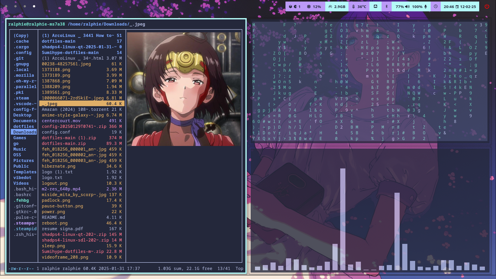
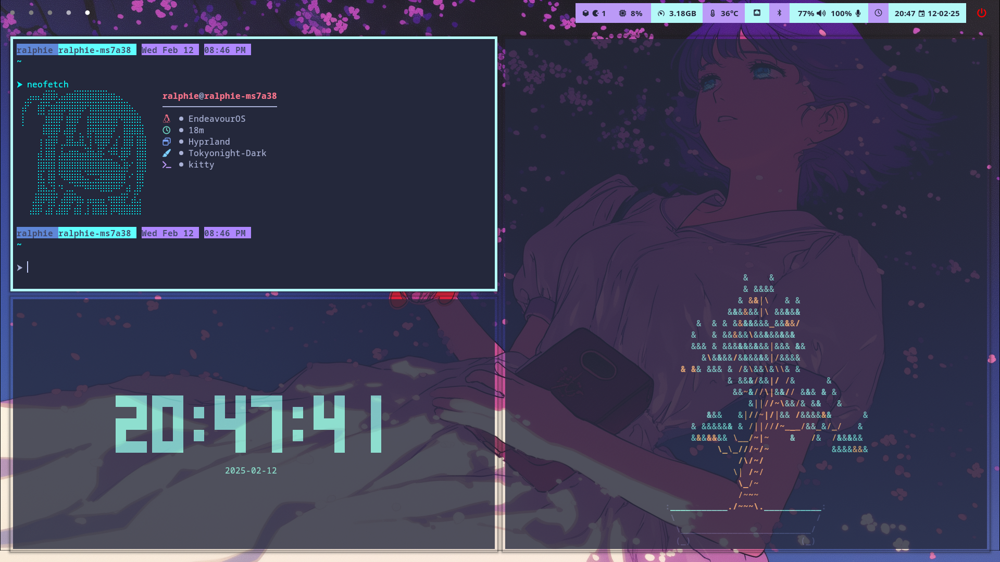
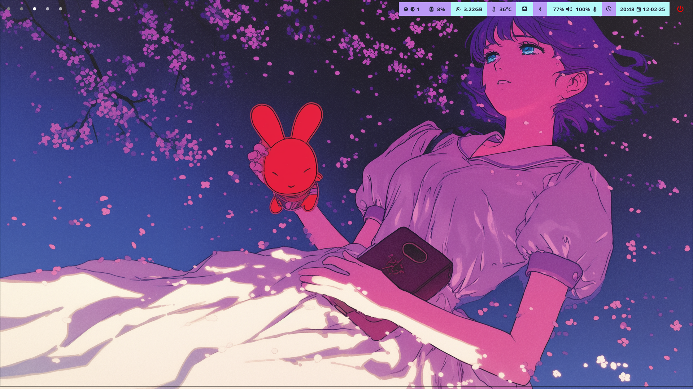

# 📦 Vibedot - My Hyprland Rice

This is my personal Hyprland rice, customized with a Tokyo Night and Dracula aesthetic and essential tools for a sleek and efficient workflow.

## 🛠 Installed Programs

| Component         | Program    |
|-------------------|------------|
| Window Manager 🪟| [Hyprland](https://github.com/hyprwm/Hyprland)  |
| Bar 📊            | [Waybar](https://github.com/Alexays/Waybar)      |
| Launcher 🚀       | [Rofi](https://github.com/davatorium/rofi)          |
| Terminal 🖥️       | [Kitty](https://github.com/kovidgoyal/kitty)        |
| File Manager 📁   | [Nautilus](https://gitlab.gnome.org/GNOME/nautilus) / [Ranger](https://github.com/ranger/ranger)      |
| System Info 🖼️    | [Neofetch](https://github.com/dylanaraps/neofetch) / [Fastfetch](https://github.com/fastfetch-cli/fastfetch) |
| Lockscreen 🔒     | [Hyprlock](https://github.com/hyprwm/hyprlock)  |
| Idle Manager ⏳   | [Hypridle](https://github.com/hyprwm/hypridle)  |
| Wallpaper 🎨      | [Hyprpaper](https://github.com/hyprwm/hyprpaper) |
| Screenshot 📸     | [Hyprshot](https://github.com/hyprwm/hyprshot) |
| Visualizer 🎵     | [Cava](https://github.com/karlstav/cava) |
| Logout Menu 🚪    | [Wlogout](https://github.com/ArtsyMacaw/wlogout) |
| Image Viewer 🖼️ | [Pillow](https://github.com/python-pillow/Pillow) |
| GTK Theme 🎨     | [Tokyo Night GTK](https://github.com/Fausto-Korpsvart/Tokyo-Night-GTK-Theme) / Custom Dracula|
| Fun 🌱           | [CMatrix](https://github.com/abishekvashok/cmatrix) / [Cbonsai](https://gitlab.com/jallbrit/cbonsai) / [tty-clock](https://github.com/xorg62/tty-clock) |

## 🎛 Keybindings

| Keybind | Action |
|---------|--------|
| `SUPER + Q` | Open Terminal |
| `SUPER + C` | Close Active Window |
| `SUPER + M` | Exit Hyprland |
| `SUPER + E` | Open File Manager |
| `SUPER + V` | Toggle Floating Window |
| `SUPER + R` | Open Rofi Launcher |
| `SUPER + P` | Toggle Pseudo-Tiling |
| `SUPER + J` | Toggle Split Mode |
| `SUPER + O` | Open VS Code |
| `SUPER + D` | Open Dolphin File Manager |
| `SUPER + W` | Open Wallpaper Picker |
| `ALT + Tab` | Cycle Through Windows |
| `SUPER + F` | Toggle Fullscreen |
| `SUPER + SHIFT + L` | Lock Screen (Hyprlock) |
| `SUPER + U` | Take Screenshot (Hyprshot) |
| `SUPER + T` | Open Matrix, Ranger, Neofetch, Cava, Cbonsai in Kitty |
| `SUPER + Arrow Keys` | Move Focus Between Windows |
| `SUPER + [1-0]` | Switch Workspaces |
| `SUPER + SHIFT + [1-0]` | Move Window to Workspace |
| `SUPER + S` | Toggle Special Workspace |
| `SUPER + SHIFT + S` | Move Window to Special Workspace |
| `SUPER + Scroll` | Cycle Through Workspaces |
| `SUPER + Left Mouse` | Move Window |
| `SUPER + Right Mouse` | Resize Window |


## 📸 Screenshots

Don't mind the lines, I have a problem with the screenshot.

<p align="center">
  
</p>
<p align="center">
  
</p>
<p align="center">
  
</p>

## ⚡ Installation

Clone the repository and run the installation script:

```bash
 git clone https://github.com/Sumichaaan19/vibedot.git
 cd ~/vibedot/scripts
 ./install.sh
```

## 🎨 Theme

This rice is based on the **Tokyo Night** and Dracula color theme, including GTK, Waybar, and terminal colors.

## 📜 Credits

- **Hyprland** - [Hyprland GitHub](https://github.com/hyprwm/Hyprland)
- **Tokyo Night Theme** - [Tokyo Night GTK](https://github.com/Fausto-Korpsvart/Tokyo-Night-GTK-Theme) / Custom Dracula
- **Waybar Config** - Inspired by multiple Waybar setups
- **Dotfiles** - Base inspiration from [igmt-official](https://github.com/igmt-official/dotfiles) / [Spelljinxer](https://github.com/Spelljinxer/dotfiles)


---

This rice is a work in progress, and I'll continue updating it with more tweaks and improvements!

